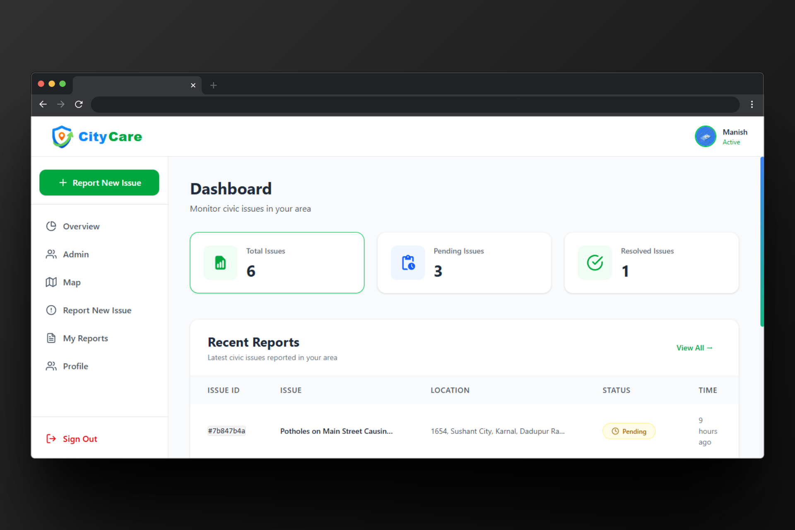

# 🏙️ CityCare - Civic Issue Reporting Platform

<div align="center">
  
  
  [](https://reactjs.org/)
  [](https://nodejs.org/)
  [](https://mongodb.com/)
  [](https://clerk.com/)
  [](https://tailwindcss.com/)
</div>

## 📸 Screenshots

### Landing Page

*Beautiful landing page with hero section and feature showcase*

### Dashboard

*User dashboard showing statistics and recent reports*

### Issue Reporting

*Issue reporting form with file upload capabilities*

### Admin Dashboard

*Admin interface for managing issues and users*


## 📋 Table of Contents

- [Overview](#overview)
- [Features](#features)
- [Tech Stack](#tech-stack)
- [Project Structure](#project-structure)
- [Installation](#installation)
- [Configuration](#configuration)
- [Usage](#usage)
- [API Documentation](#api-documentation)
- [Authentication](#authentication)
- [Deployment](#deployment)
- [Contributing](#contributing)
- [License](#license)

## 🎯 Overview

CityCare is a modern, full-stack civic issue reporting platform that empowers citizens to report problems in their communities and track their resolution. Built with React, Node.js, and MongoDB, it provides a seamless experience for both citizens and city administrators.

### 🌟 Key Highlights

- **Citizen-First Design**: Intuitive interface for easy issue reporting
- **Real-Time Tracking**: Monitor issue status from submission to resolution
- **Multi-Media Support**: Upload photos and videos as evidence
- **Location-Based**: Pin exact locations on interactive maps
- **Admin Dashboard**: Comprehensive management tools for city officials
- **Secure Authentication**: Enterprise-grade security with Clerk
- **Mobile Responsive**: Works perfectly on all devices

## ✨ Features

### 🏠 Landing Page

- **Beautiful Hero Section** with animated statistics
- **Feature Showcase** highlighting platform capabilities
- **User Testimonials** with rotating carousel
- **Authentication Integration** with clear sign-in prompts
- **Responsive Design** optimized for all screen sizes

### 👤 User Features

- **Issue Reporting**: Submit detailed reports with photos/videos
- **Progress Tracking**: Real-time status updates
- **My Reports**: Personal dashboard for submitted issues
- **Profile Management**: Update personal information
- **Interactive Maps**: Location-based issue visualization
- **Real-Time Notifications**: Get instant updates when admins update your issues
- **Notification Center**: Beautiful dropdown with notification history
- **Smart Filtering**: Filter reports by status, category, and urgency

### 🛠️ Admin Features

- **Dashboard Overview**: Comprehensive statistics and analytics
- **Issue Management**: Review, update, and resolve reports
- **User Management**: Monitor citizen engagement
- **Status Updates**: Communicate progress to reporters with automatic notifications
- **Bulk Operations**: Efficient batch processing
- **Advanced Search**: Find issues quickly with powerful filters

### 🔐 Security & Authentication
- **Clerk Integration**: Secure user authentication
- **Role-Based Access**: Different permissions for users and admins
- **Protected Routes**: Automatic redirects based on authentication
- **Data Encryption**: Secure file uploads and storage

### 🔔 Notification System
- **Real-Time Updates**: Get notified when admins update your issues
- **Beautiful UI**: Smooth animations and modern design
- **Notification Types**: Different icons for resolved, rejected, in-progress, and comment updates
- **Mark as Read**: Track which notifications you've seen
- **Auto-Refresh**: Checks for new notifications every 30 seconds
- **Quick Navigation**: Click notifications to jump to issue details

## 🛠️ Tech Stack

### Frontend
- **React 19.1.1** - Modern UI library
- **React Router DOM** - Client-side routing
- **Tailwind CSS** - Utility-first styling
- **React Icons** - Comprehensive icon library
- **Clerk React** - Authentication and user management
- **Vite** - Fast build tool and development server

### Backend
- **Node.js** - JavaScript runtime
- **Express.js** - Web application framework
- **MongoDB** - NoSQL database
- **Mongoose** - MongoDB object modeling
- **Multer** - File upload handling
- **JWT** - JSON Web Token authentication
- **CORS** - Cross-origin resource sharing

### Development Tools
- **ESLint** - Code linting and formatting
- **Nodemon** - Development server auto-restart
- **PostCSS** - CSS processing
- **Autoprefixer** - CSS vendor prefixing

## 📁 Project Structure

```
CityCare/
├── docs/                       # Documentation and images
│   └── images/                # README images
│       ├── landing-page.png
│       ├── dashboard.png
│       ├── issue-reporting.png
│       ├── admin-dashboard.png
│       ├── mobile-view.png
│       ├── landing-features.png
│       ├── user-features.png
│       └── admin-features.png
├── frontend/                    # React frontend application
│   ├── public/                 # Static assets
│   │   ├── logo1.png          # Main logo
│   │   └── vite.svg           # Vite logo
│   ├── src/
│   │   ├── components/        # Reusable UI components
│   │   │   ├── Navbar.jsx    # Navigation component
│   │   │   ├── Sidebar.jsx   # Sidebar navigation
│   │   │   └── NotificationDropdown.jsx  # Notification system
│   │   ├── pages/            # Page components
│   │   │   ├── LandingPage.jsx      # Landing page
│   │   │   ├── Dashboard.jsx        # User dashboard
│   │   │   ├── AdminDashboard.jsx   # Admin dashboard
│   │   │   ├── AdminReportDetail.jsx # Admin issue detail view
│   │   │   ├── ReportNewIssue.jsx  # Issue reporting
│   │   │   ├── MyReports.jsx        # User's reports
│   │   │   ├── MyReportDetail.jsx  # User issue detail view
│   │   │   ├── Map.jsx             # Interactive map
│   │   │   └── Profile.jsx         # User profile
│   │   ├── services/         # API service layer
│   │   │   ├── api.js        # Base API configuration
│   │   │   ├── issueService.js    # Issue-related API calls
│   │   │   └── userService.js     # User-related API calls
│   │   ├── hooks/            # Custom React hooks
│   │   │   └── useUser.js    # User management hook
│   │   ├── style/            # CSS styles
│   │   │   ├── LandingPage.css     # Landing page styles
│   │   │   ├── AdminDashboard.module.css  # Admin styles
│   │   │   └── MapPage.css         # Map page styles
│   │   ├── App.jsx           # Main application component
│   │   ├── main.jsx         # Application entry point
│   │   └── index.css        # Global styles
│   ├── package.json         # Frontend dependencies
│   └── vite.config.js      # Vite configuration
├── backend/                  # Node.js backend application
│   ├── config/              # Configuration files
│   │   └── database.js      # MongoDB connection
│   ├── controllers/         # Route controllers
│   │   ├── issueController.js   # Issue management logic
│   │   └── userController.js    # User management logic
│   ├── middleware/          # Custom middleware
│   │   ├── errorHandler.js      # Error handling
│   │   └── validateRequest.js   # Request validation
│   ├── models/              # Database models
│   │   ├── Issue.js         # Issue schema with updates tracking
│   │   └── User.js          # User schema with notifications
│   ├── routes/              # API routes
│   │   ├── issueRoutes.js   # Issue endpoints
│   │   └── userRoutes.js    # User and notification endpoints
│   ├── uploads/             # File upload directory
│   ├── server.js           # Main server file
│   ├── testNotifications.js # Notification system test script
│   ├── package.json        # Backend dependencies
│   └── .env                # Environment variables
├── README.md               # This file
└── Documentation/          # Additional documentation
```

## 📸 Adding Images to README

### How to Add Images

1. **Create Images Directory**:
   ```bash
   mkdir -p docs/images
   ```

2. **Take Screenshots** of your application:
   - Landing page
   - Dashboard views
   - Issue reporting form
   - Admin interface
   - Mobile responsive views

3. **Save Images** in the `docs/images/` directory with descriptive names:
   ```
   docs/images/
   ├── landing-page.png
   ├── dashboard.png
   ├── issue-reporting.png
   ├── admin-dashboard.png
   ├── mobile-view.png
   ├── landing-features.png
   ├── user-features.png
   └── admin-features.png
   ```

4. **Reference Images** in README using markdown syntax:
   ```markdown
   
   ```

### Image Guidelines

- **Format**: Use PNG or JPG format
- **Size**: Keep images under 1MB for GitHub
- **Dimensions**: Recommended 1200x800px for screenshots
- **Quality**: Use high-quality, clear screenshots
- **Alt Text**: Always include descriptive alt text

### Alternative Image Hosting

If you prefer external hosting:

1. **GitHub Issues**: Upload images to GitHub issues (get direct links)
2. **Imgur**: Upload to Imgur and use direct links
3. **Cloud Storage**: Use Google Drive, Dropbox, etc. (make sure links are public)

Example with external hosting:
```markdown

```

## 🚀 Installation

### Prerequisites

- **Node.js** (v16 or higher)
- **MongoDB** (v4.4 or higher)
- **Git** (for version control)

### Step 1: Clone the Repository

```bash
git clone https://github.com/yourusername/citycare.git
cd citycare
```

### Step 2: Install Backend Dependencies

```bash
cd backend
npm install
```

### Step 3: Install Frontend Dependencies

```bash
cd ../frontend
npm install
```

### Step 4: Environment Setup

Create a `.env` file in the backend directory:

```env
# Backend Environment Variables
MONGODB_URI=mongodb://localhost:27017/citycare
PORT=5000
NODE_ENV=development
JWT_SECRET=your_super_secret_jwt_key_here
```

Create a `.env` file in the frontend directory:

```env
# Frontend Environment Variables
VITE_CLERK_PUBLISHABLE_KEY=pk_test_your_clerk_publishable_key_here
VITE_API_URL=https://citycare-8l8p.onrender.com//api
VITE_ADMIN_EMAILS=admin@citycare.com,manager@citycare.com
```

## ⚙️ Configuration

### MongoDB Setup

1. **Install MongoDB** on your system
2. **Start MongoDB** service:
   ```bash
   # Windows
   net start MongoDB
   
   # macOS/Linux
   sudo systemctl start mongod
   ```
3. **Create Database**:
   ```bash
   mongo
   use citycare
   ```

### Clerk Authentication Setup

1. **Create Clerk Account** at [clerk.com](https://clerk.com)
2. **Create New Application** in Clerk Dashboard
3. **Get API Keys** from Clerk Dashboard
4. **Update Environment Variables** with your keys
5. **Configure Authentication** settings in Clerk Dashboard

### File Upload Configuration

The application supports file uploads for images and videos:

- **Supported Formats**: JPG, PNG, WEBP, MP4, MOV
- **Maximum Size**: 10MB per file
- **Storage**: Local filesystem (configurable for cloud storage)

## 🎮 Usage

### Development Mode

1. **Start Backend Server**:
   ```bash
   cd backend
   npm run dev
   ```
   Server runs on `https://citycare-8l8p.onrender.com/`

2. **Start Frontend Development Server**:
   ```bash
   cd frontend
   npm run dev
   ```
   Application runs on `http://localhost:5173`

3. **Open Browser** and navigate to `http://localhost:5173`

### Production Mode

1. **Build Frontend**:
   ```bash
   cd frontend
   npm run build
   ```

2. **Start Production Server**:
   ```bash
   cd backend
   npm start
   ```

## 📚 API Documentation

### Base URL
```
https://citycare-8l8p.onrender.com//api
```

### Authentication Endpoints

#### User Registration/Login
```http
POST /api/users/register
POST /api/users/login
```

#### User Profile
```http
GET /api/users/profile/:clerkId
PUT /api/users/profile
POST /api/users/profile
```

### Notification Endpoints

#### Get User Notifications
```http
GET /api/users/notifications/:clerkId?limit=20&unreadOnly=false
```

#### Mark Notification as Read
```http
PUT /api/users/notifications/:clerkId/:notificationId/read
```

#### Mark All Notifications as Read
```http
PUT /api/users/notifications/:clerkId/read-all
```

### Issue Management Endpoints

#### Create Issue
```http
POST /api/issues
Content-Type: multipart/form-data

{
  "title": "Pothole on Main Street",
  "description": "Large pothole causing traffic issues",
  "category": "Infrastructure",
  "location": "123 Main Street, City",
  "urgency": "High",
  "images": [file1, file2],
  "videos": [file3]
}
```

#### Get All Issues
```http
GET /api/issues
```

#### Get User's Issues
```http
GET /api/issues/user/:userId
```

#### Update Issue Status
```http
PUT /api/issues/:id/status
{
  "status": "In Progress",
  "adminNotes": "Work crew assigned"
}
```

### File Upload Endpoints

#### Upload Images/Videos
```http
POST /api/issues/:id/upload
Content-Type: multipart/form-data
```

## 🔐 Authentication

### User Roles

1. **Citizen**: Can report issues and track their reports
2. **Admin**: Can manage all issues and users

### Authentication Flow

1. **Landing Page**: Unauthenticated users see marketing page
2. **Sign In**: Users authenticate via Clerk
3. **Dashboard Redirect**: Authenticated users go directly to dashboard
4. **Protected Routes**: All app features require authentication

### Security Features

- **JWT Tokens**: Secure session management
- **Role-Based Access**: Different permissions for users and admins
- **Input Validation**: All user inputs are validated
- **File Upload Security**: Type and size validation
- **CORS Protection**: Cross-origin request security

## 🚀 Deployment

### Backend Deployment (Heroku)

1. **Create Heroku App**:
   ```bash
   heroku create citycare-backend
   ```

2. **Set Environment Variables**:
   ```bash
   heroku config:set MONGODB_URI=your_mongodb_atlas_uri
   heroku config:set JWT_SECRET=your_jwt_secret
   heroku config:set NODE_ENV=production
   ```

3. **Deploy**:
   ```bash
   git push heroku main
   ```

### Frontend Deployment (Vercel)

1. **Install Vercel CLI**:
   ```bash
   npm i -g vercel
   ```

2. **Deploy**:
   ```bash
   cd frontend
   vercel --prod
   ```

3. **Set Environment Variables** in Vercel Dashboard

### Database Deployment (MongoDB Atlas)

1. **Create MongoDB Atlas Account**
2. **Create Cluster**
3. **Get Connection String**
4. **Update Environment Variables**

## 🧪 Testing

### Backend Testing
```bash
cd backend
npm test
```

### Frontend Testing
```bash
cd frontend
npm test
```

### Manual Testing Checklist

- [ ] User registration and login
- [ ] Issue reporting with file uploads
- [ ] Issue status tracking
- [ ] Admin dashboard functionality
- [ ] Mobile responsiveness
- [ ] Authentication redirects

## 🤝 Contributing

### Development Workflow

1. **Fork the Repository**
2. **Create Feature Branch**:
   ```bash
   git checkout -b feature/amazing-feature
   ```
3. **Commit Changes**:
   ```bash
   git commit -m 'Add amazing feature'
   ```
4. **Push to Branch**:
   ```bash
   git push origin feature/amazing-feature
   ```
5. **Open Pull Request**

### Code Standards

- **ESLint**: Follow configured linting rules
- **Prettier**: Consistent code formatting
- **Comments**: Document complex logic
- **Testing**: Write tests for new features

## 📊 Performance

### Optimization Features

- **Code Splitting**: Lazy loading of components
- **Image Optimization**: Compressed and responsive images
- **Caching**: API response caching
- **Bundle Size**: Optimized production builds
- **Database Indexing**: Efficient query performance

### Performance Metrics

- **First Contentful Paint**: < 1.5s
- **Largest Contentful Paint**: < 2.5s
- **Cumulative Layout Shift**: < 0.1
- **Time to Interactive**: < 3.5s

## 🐛 Troubleshooting

### Common Issues

1. **MongoDB Connection Error**:
   - Check MongoDB service is running
   - Verify connection string in .env

2. **Clerk Authentication Issues**:
   - Verify API keys in environment variables
   - Check Clerk dashboard configuration

3. **File Upload Errors**:
   - Check file size limits
   - Verify supported file types
   - Ensure uploads directory exists

4. **CORS Errors**:
   - Verify frontend URL in backend CORS settings
   - Check API URL in frontend environment

### Debug Mode

Enable debug logging:
```bash
# Backend
DEBUG=citycare:* npm run dev

# Frontend
VITE_DEBUG=true npm run dev
```

## 📈 Roadmap

### Upcoming Features

- [ ] **Mobile App**: React Native mobile application
- [ ] **Real-time Notifications**: WebSocket integration for instant updates
- [ ] **Push Notifications**: Browser and mobile push notifications
- [ ] **Advanced Analytics**: Detailed reporting dashboard
- [ ] **Multi-language Support**: Internationalization
- [ ] **API Rate Limiting**: Enhanced security
- [ ] **Cloud Storage**: AWS S3 integration for file uploads
- [ ] **Email Notifications**: Automated status updates via email
- [ ] **Social Sharing**: Share issues on social media
- [ ] **Notification Preferences**: Customize notification settings
- [ ] **Dark Mode**: Theme toggle for better user experience

### Recent Updates

- **v1.4.0** (Current) - Added real-time notification system
  - Notification dropdown with smooth animations
  - Auto-refresh every 30 seconds
  - Different notification types (resolved, rejected, in-progress, comment)
  - Mark as read functionality
  - Enhanced UI with color-coded notifications
  - Smooth animations and transitions
  - Hidden scrollbars for cleaner look

- **v1.3.0** - Improved authentication flow
- **v1.2.0** - Enhanced file upload system
- **v1.1.0** - Added admin dashboard
- **v1.0.0** - Initial release with core features

## 📞 Support

### Getting Help

- **Documentation**: Check this README and inline code comments
- **Issues**: Create GitHub issues for bugs or feature requests
- **Discussions**: Use GitHub Discussions for questions
- **Email**: Contact support@citycare.com

### Community

- **GitHub**: [github.com/citycare](https://github.com/citycare)
- **Discord**: [discord.gg/citycare](https://discord.gg/citycare)
- **Twitter**: [@citycare_app](https://twitter.com/citycare_app)

## 🙏 Acknowledgments

- **React Team** for the amazing framework
- **Clerk** for authentication services
- **MongoDB** for database solutions
- **Tailwind CSS** for styling framework
- **Open Source Community** for inspiration and tools

---

<div align="center">
  <p>Made with ❤️ for better cities</p>
  <p>© 2024 CityCare. All rights reserved.</p>
</div>
